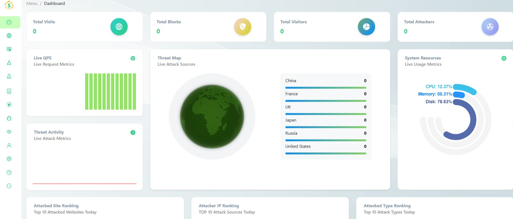
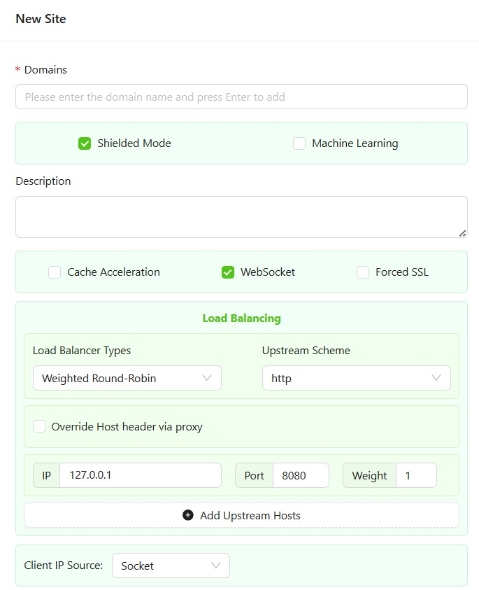
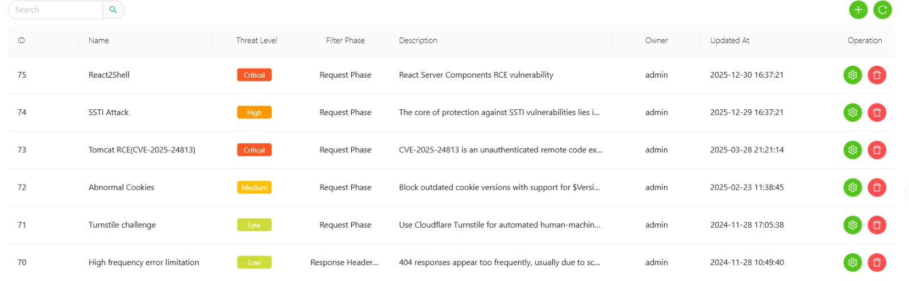

# UUSEC WAF — Configuración y evaluación

> Basado en la documentación oficial: https://github.com/Safe3/uusec-waf

---

## Requerimientos previos

- Sistema con arquitectura x86_64
- Puertos libres: 80, 443, 4443
- Docker CE 20.10.14 o superior
- Docker Compose 2.0.0 o superior

> En caso de no contar con Docker, el script de instalación lo instala automáticamente.

---

## Instalación

El proceso consiste en la ejecución de un único comando que descarga y ejecuta el script de instalación oficial, encargado de validar Docker, crear los contenedores del WAF y su base de datos MySQL:

```bash
sudo bash -c "$(curl -fsSL https://waf.uusec.com/installer.sh)"
```

Una vez finalizado, se crean dos contenedores: uno para el WAF y otro para la base de datos MySQL.

---

## Acceso a la interfaz de administración

```
http://ip_máquina:4443
```

Credenciales por defecto:

| Campo | Valor |
|---|---|
| Usuario | admin |
| Contraseña | #Passw0rd |

> Se recomienda cambiar la contraseña por defecto tras el primer acceso.

Una vez se accede se tiene una interfaz similar a la presentada a continuación:



Asimismo, una vez se accede a la interfaz de configuración, en el panel de la izquierda, existen diferentes opciones para la personalización de su configuración, por ejemplo, se encuentra la configuración del sitio, particularmente en la sección de *load balancing* se indica el puerto y la dirección ip correspondientes al servidor web para configurar Uusec como reverse proxy. Y se selecciona el conjunto de reglas utilizadas de base.

<p align="center">
  
</p>
Por otro lado, en el panel de la izquierda, también es posible acceder a las distintas reglas con las que cuenta el WAF por defecto, asi como también se indica su nivel de amenaza. Este nivel de configuración es personalizable y adaptable.



A continuación se describe de manera más detallada los distintos modos de configuración de UusecWaf.

---

## Configuración inicial

### Modos de operación

| Modo | Descripción |
|---|---|
| **Shielded Mode** | Activa la protección completa del WAF. Cuando está habilitado, bloquea los ataques detectados; cuando está deshabilitado, solo los registra sin bloquear. |
| **Machine Learning** | Motor de IA para detección de anomalías. Disponible únicamente en la versión premium. |

### Funcionalidades adicionales

| Funcionalidad | Descripción |
|---|---|
| **Cache Acceleration** | Caché de contenido estático. Almacena respuestas del backend y sirve contenido estático sin contactarlo nuevamente. |
| **Streaming Response** | Habilita transmisión continua de datos para video, audio, SSE o descargas grandes. |
| **WebSocket** | Soporte para comunicación bidireccional persistente. Si la aplicación no lo utiliza, se recomienda desactivarlo para reducir overhead. |
| **Forced SSL** | Redirige tráfico HTTP a HTTPS. Requiere certificados configurados previamente. |

---

## Arquitectura

UUSEC WAF opera como reverse proxy en capa 7:

```
Cliente → WAF → Servidor Web
```

Inspecciona headers y payload, filtra por reglas y bloquea ataques web (SQLi, XSS, LFI, RCE, entre otros).

---

## Configuración del proxy

### Dominio protegido

Definir el dominio o subdominio que el WAF interceptará:

```
test.local
```

### Load balancing

| Algoritmo | Descripción | Cuándo usar |
|---|---|---|
| **Round-Robin** | Reparte peticiones por turnos entre servidores | Servidores con capacidad similar |
| **Weighted Round-Robin** | Reparte según peso asignado a cada servidor | Servidores con capacidad diferente |
| **Least Connections** | Envía al servidor con menos conexiones activas | Peticiones de duración variable |
| **IP Hash** | El mismo cliente siempre va al mismo servidor | Aplicaciones con sesiones sin almacenamiento compartido |

> Si se cuenta con un solo backend, el algoritmo no es relevante.

### Client IP source

| Opción | Descripción | Cuándo usar |
|---|---|---|
| **Socket** | IP de la conexión TCP directa | Sin proxies delante del WAF |
| **X-Forwarded-For** | Lee el header `X-Forwarded-For` | Hay CDN o proxy antes del WAF |
| **HTTP Header** | Lee un header personalizado | Configuración avanzada |

---

## Whitelist de IPs

IPs que nunca serán bloqueadas por el WAF. Se recomienda agregar la IP de la máquina de pruebas para evitar bloqueos accidentales durante la evaluación:

```
192.168.1.x   # Máquina atacante / testing
10.0.0.0/24   # Red interna
```

---

## Whitelist de URLs

URLs específicas que quedarán excluidas de la protección del WAF. Útil para endpoints administrativos o de monitoreo que no deben ser filtrados.

---

## Referencias

- Documentación oficial: https://github.com/Safe3/uusec-waf
- Portal del producto: https://waf.uusec.com
